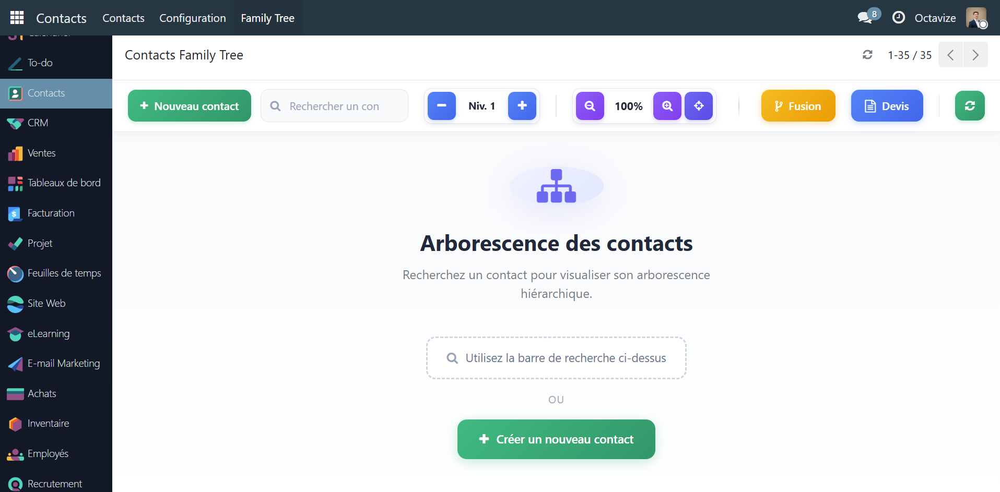
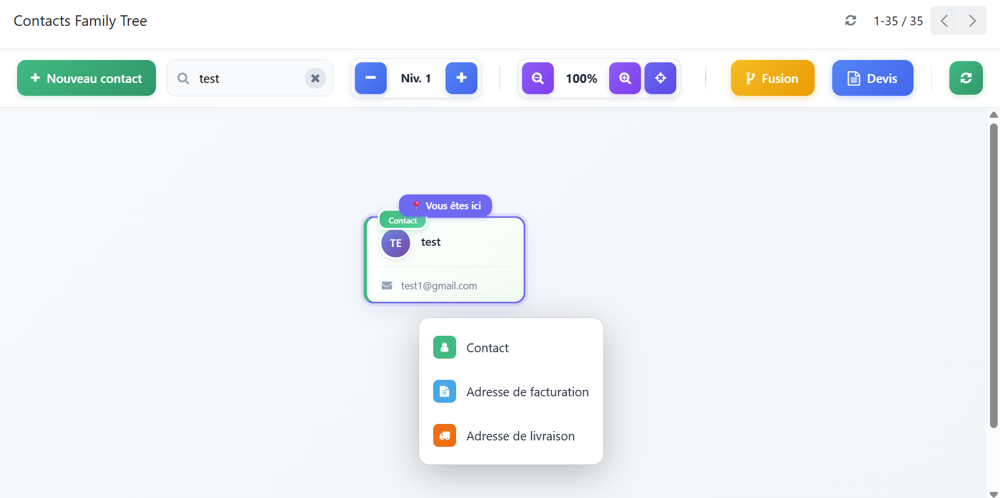
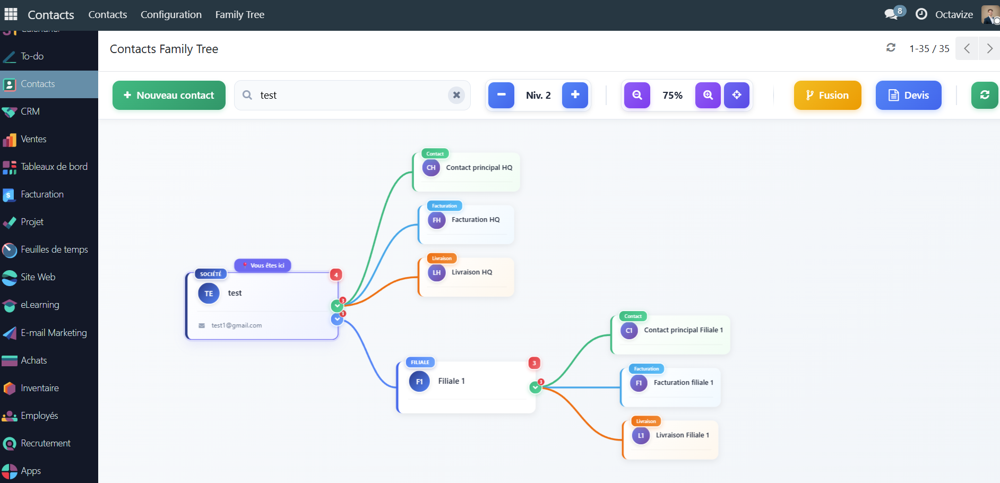
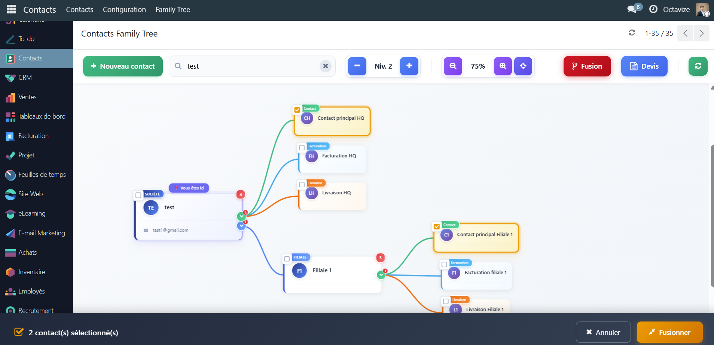
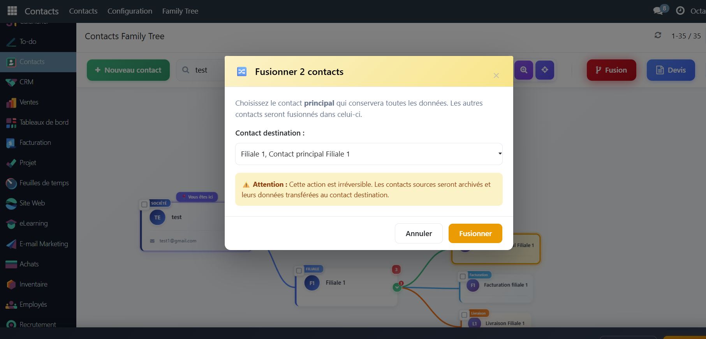
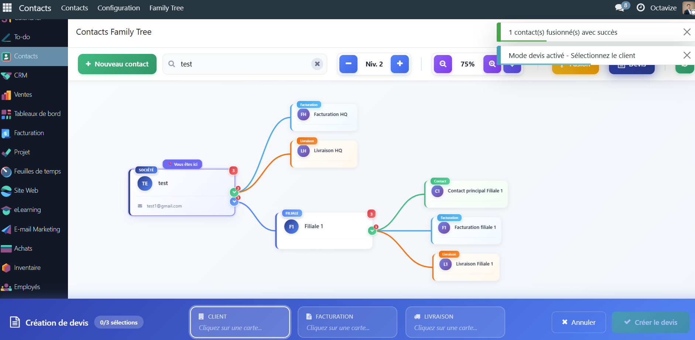

# Octavize Partner Family Tree

Module Odoo 19 (Community) autonome qui ajoute une vue "Arbre
Généalogique" pour visualiser, organiser et fusionner la hiérarchie des
contacts (sociétés, filiales, adresses, personnes) sous forme de carte
interactive.

## Pourquoi ce module

La vue liste native de `res.partner` ne montre pas la structure
société → filiale → contact → adresse de facturation/livraison : un
commercial qui ne maîtrise pas l'arborescence des contacts Odoo crée
souvent un nouveau contact plutôt que de rattacher le bon interlocuteur
au bon parent. Résultat classique sur une base CRM qui vit depuis
plusieurs mois : contacts en double, sociétés mal reliées à leurs
filiales, fiches incomplètes — du bruit qui pollue le reporting
commercial et complique la relance client.

Ce module donne à l'équipe commerciale une interface visuelle simple
pour :

- **voir d'un coup d'œil** la hiérarchie complète d'un compte (société,
  filiales, contacts, adresses) sans naviguer fiche par fiche ;
- **identifier le rôle de chaque fiche** (société mère, filiale, société
  seule, contact de référence, adresse de facturation/livraison/privée/
  autre, particulier seul, auto-entrepreneur) grâce à une étiquette de
  couleur reprise à l'identique dans l'arbre, les fiches, les listes et
  les kanbans ;
- **créer un contact au bon endroit** dans la hiérarchie plutôt qu'en
  doublon, avec un rappel de la norme de nommage attendue (ordre du nom
  pour une société, "NOM Prénom" pour une personne) ;
- **réorganiser** une structure de comptes existante (changement de
  parent) sans passer par la vue technique ;
- **fusionner les doublons** de contacts détectés, en conservant la
  fiche principale et en archivant l'autre ;
- **repérer un produit saisi deux fois** sur un même devis, commande
  d'achat, transfert de stock ou facture (ligne colorée, avertissement
  non bloquant à la saisie) ;
- **lancer un devis** directement depuis la fiche d'un contact de
  l'arbre, avec les bonnes adresses de facturation/livraison.

L'objectif est la lutte contre le bruit et les doublons dans la base de
contacts CRM : une hygiène de données correcte en amont évite des
erreurs de facturation, des relances manquées ou doublées, et un
reporting commercial faussé par des comptes mal structurés.

## Aperçu

Les captures ci-dessous proviennent de la même fonctionnalité intégrée
dans un module plus large ; l'interface de ce module autonome est
identique (recherche, hiérarchie, fusion, création de devis).

| | |
|---|---|
|  |  |
|  |  |
|  |  |

## Ce que fait le module

Étend `res.partner` d'une action `action_open_family_tree()` (bouton
"Arbre" sur la fiche contact) qui ouvre une vue kanban custom
(`js_class="octavize_family_tree"`) affichant la hiérarchie complète à
partir de la société racine, avec mise en évidence du contact
d'origine. Le composant OWL (`FamilyTreeController`/`FamilyTreeRenderer`)
gère :

- **Visualisation hiérarchique** en cartes connectées (société → HQ/
  filiales → contacts → adresses de facturation/livraison), avec
  zoom, dépliage/repliage des branches et sélection de racine.
- **Recherche** de contact par nom, avec bascule automatique vers une
  liste de résultats filtrés.
- **Fiche détaillée** en pop-up (nom, fonction, coordonnées, adresse,
  site web, TVA, référence, notes) avec bouton "Modifier" ouvrant le
  formulaire natif `res.partner`.
- **Changement de parent** via un wizard dédié
  (`partner.change.parent.wizard`), avec sélecteur arborescent et
  recherche.
- **Création de contact** directement depuis l'arbre
  (`partner.create.contact.wizard`), ouvrant ensuite la vue centrée sur
  le nouveau contact.
- **Mode fusion** : sélection multiple de contacts, choix du contact
  destination, ré-attachement des enfants et archivage des sources.
- **Création de devis** depuis une carte de l'arbre, avec sélection des
  adresses de facturation/livraison (ouvre `sale.order` pré-rempli).

Ajoute par ailleurs à `res.partner` :

- **Étiquette de rôle** (`partner_role`, calculée et stockée) : chaque
  fiche reçoit automatiquement exactement un rôle parmi société mère /
  filiale / société seule / contact de référence / adresse de
  facturation / adresse de livraison / adresse privée / autre adresse /
  particulier seul / auto-entrepreneur, avec une couleur dédiée
  (`partner_role_color`) reprise partout dans le back-office.
- **Onglet "Filiales"** sur la fiche société (`filiale_ids`), distinct
  de l'onglet Contacts qui ne montre plus que les adresses et contacts
  humains (`address_ids`).
- **Norme de nommage des contacts** (modèle `naming.norm`, un
  enregistrement par cible société/personne, éditable dans
  Contacts > Configuration > Naming Standards) : rappel non bloquant
  sous le nom (`naming_norm_hint`) et avertissements en direct
  (`name_warnings`) sur les fiches société (ordre nom / forme
  juridique / ville) et personne (graphie "NOM Prénom").
- **Détection de doublon produit** (mixin
  `octavize.duplicate.product.mixin`) sur les lignes de devis, commande
  d'achat, transfert de stock et facture : coloration de la ligne et
  avertissement à la saisie quand le même produit apparaît deux fois
  sur un même document. Non bloquant.

## Impact sur l'instance

Le mode fusion (`performMerge()`) **ne transfère que la hiérarchie
parent/enfant** (`res.partner.parent_id`) et archive les contacts
sources — il ne migre pas les commandes, factures, opportunités CRM ou
messages liés aux contacts fusionnés (contrairement à un outil de
fusion complet). Voir Limites connues.

## Plateforme et prérequis d'installation

- Odoo 19.0, module Community.
- Dépend de `base`, `contacts`, `web`, `sale`, `purchase`, `stock`,
  `account` (`sale` est requis pour la création de devis depuis
  l'arbre ; `purchase`/`stock`/`account` pour la détection de doublon
  produit sur les commandes d'achat, les transferts et les factures).
- Les wizards de l'arbre sont accessibles à tout utilisateur interne
  (`security/ir.model.access.csv` sans restriction de groupe) ; les
  droits effectifs suivent ceux déjà en place sur `res.partner`. La
  configuration de la norme de nommage (`naming.norm`) est réservée au
  groupe Administration/Settings (`base.group_system`), en lecture
  seule pour les autres utilisateurs internes.
- Deux normes de nommage par défaut sont installées (société, personne)
  et éditables sans redémarrage dans
  Contacts > Configuration > Naming Standards.

## Sécurité

Les données de contact (nom, fonction, email, téléphone, adresse,
notes...) affichées dans les pop-up de détail, le sélecteur de parent
et le dialogue de fusion sont échappées avant insertion dans le DOM
(`escapeHtml()`) : un nom ou un champ note contenant du HTML/JS ne
s'exécute pas dans le navigateur de l'utilisateur consultant l'arbre.

## Limites connues

- Le mode fusion ne transfère que `parent_id` des enfants directs et
  archive la source — aucune redirection des ventes, factures,
  activités, messages ou followers liés au contact archivé. À utiliser
  pour du nettoyage de hiérarchie simple, pas comme outil de fusion
  complet de fiches contact.
- Aucune restriction de groupe sur les wizards de changement de parent,
  création de contact ou fusion — tout utilisateur interne standard
  peut les utiliser ; à restreindre par groupe si besoin en production.
- `family_tree_controller.js` est un fichier volumineux (~2600 lignes)
  concentrant logique de rendu, dialogues et actions — pas de
  découpage en composants OWL séparés.
- Les tests Python (`tests/`) couvrent la norme de nommage des contacts
  et la détection de doublon produit ; le test de l'arbre lui-même
  (`test_family_tree.py`) pilote un vrai navigateur et est taggé
  `-standard` car Chrome headless ne démarre pas dans tous les
  environnements de CI.

## Tests

```bash
odoo-bin -u octavize_partner_family_tree --test-enable --test-tags /octavize_partner_family_tree --stop-after-init --no-http
```

Le test de l'arbre (navigateur réel) est exclu du tag standard ; le lancer
séparément sur une machine disposant d'un Chrome headless fonctionnel :

```bash
odoo-bin -u octavize_partner_family_tree --test-enable --test-tags family_tree_browser --stop-after-init
```

## Réutilisation

Module autonome et générique, sans dépendance à un système de
classification de contacts propriétaire — directement réutilisable sur
toute instance Odoo 19 Community avec `contacts` et `sale` installés.

## Licence

LGPL-3 — voir [LICENSE](LICENSE).
